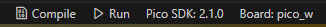
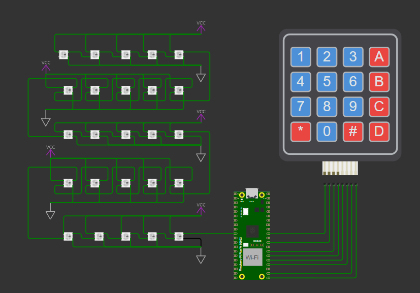

# Controle de Matriz de LEDs 5x5 WS2812 com Teclado Matricial

## Descrição
Com o auxílio do simulador de eletrônica Wokwi, utilizamos um teclado matricial 4x4 para controlar os LEDs de uma matriz 5x5 WS2812, presente na placa BitDogLab. Cada tecla do teclado possui uma função específica para controlar os LEDs, ativando diferentes animações ou estados. Este projeto faz uso do microcontrolador RP2040 integrado na placa de desenvolvimento Raspberry Pi Pico W. Os componentes utilizados foram:

1. Teclado matricial 4x4.
2. Microcontrolador Raspberry Pi Pico W.
3. Matriz de LEDs Coloridos (LED-RGB 5x5 WS2812).

## Funcionalidades
O teclado matricial permite controlar a matriz de LEDs com as seguintes funcionalidades:

- **Teclas de 0 a 9**: Cada tecla aciona uma animação específica na matriz de LEDs.
- **Tecla A**: Todos os LEDs serão desligados.
- **Tecla B**: Todos os LEDs serão ligados na cor azul com 100% da luminosidade.
- **Tecla C**: Todos os LEDs serão ligados na cor vermelha com 80% da luminosidade.
- **Tecla D**: Todos os LEDs serão ligados na cor verde com 50% da luminosidade.
- **Tecla #**: Todos os LEDs serão ligados na cor branca com 20% da luminosidade.

[Vídeo de Demonstração](https://www.dropbox.com/scl/fi/au3jbqm3ffoih3lpt1d1o/Tarefa_PicoW_2.mp4?rlkey=cfb8g5fk5odezn5j033517u0j&st=9p2eawhl&dl=0)

## Como compilar
Para compilar o programa, utilize um compilador C, gerando os arquivos `.uf2` e `.elf`. Siga os passos abaixo:

1. Configure o ambiente de desenvolvimento para o Raspberry Pi Pico.
2. Compile o código utilizando um compilador compatível.

Segue um exemplo do botão de compilação:

## Como executar
Após a compilação, execute o simulador Wokwi clicando no arquivo `diagram.json`:

Para testar, clique em "Play" no Wokwi e explore o circuito com o teclado matricial.

## Requisitos
- Compilador C (gcc ou equivalente).
- Sistema operacional compatível com programas C.
- Extensão Raspberry Pi Pico.
- Wokwi configurado no VS Code.

## Desenvolvedores
Equipe 2 - Grupo 3 - EmbarcaTech
- [Lucas Luige](https://github.com/lluigecm)
- [Evelyn Suzarte](https://github.com/Evelynsuzarte)
- [Caio Natividade](https://github.com/CaioNatividade)
- [Luiz Marcelo](https://github.com/devluinix)
- [Thiago Ribeiro](https://github.com/devthiagoribeiro)
- [Mateus Coelho](https://github.com/mateuscoelhw)
- [Daniel Santos](https://github.com/DanielSantos08)
- [Luan Pereira](https://github.com/naulcs)
- [Maria Vitória](https://github.com/MaryVickk)
- [Joel Santos](https://github.com/JoelSantos-JS)
